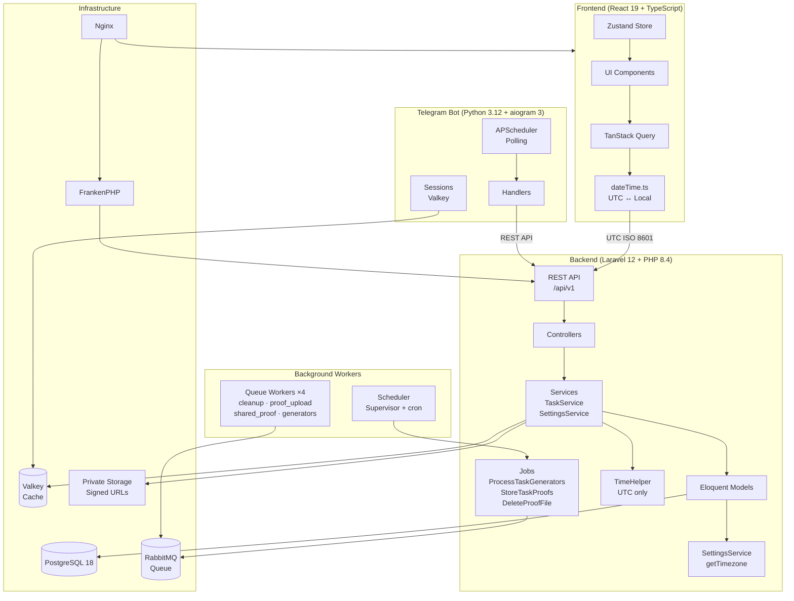

# TaskMate

Система управления задачами для автосалонов.

## Архитектура



## Работа с датами и временем

### Гибридный подход: UTC + Timezone для календарных дней

Система использует **гибридный подход** к работе с датами:

| Тип данных | Хранение | Пример |
|------------|----------|--------|
| **Моменты времени** (deadline, created_at) | UTC | `2026-01-27T10:00:00Z` |
| **Календарные дни** (выходные, праздники) | Дата + timezone автосалона | `2026-01-27` + `+05:00` |

```
┌─────────────┐    UTC ISO 8601     ┌─────────────┐
│   Frontend  │ ←─────────────────→ │   Backend   │
│ (браузер TZ)│  2026-01-27T10:00Z  │   (UTC)     │
└─────────────┘                     └─────────────┘
                                           │
                                           ▼
                              ┌────────────────────────┐
                              │ CalendarDay::isHoliday │
                              │ UTC → Dealership TZ    │
                              │ для определения даты   │
                              └────────────────────────┘
```

### Dashboard: задачи за сегодня

Блок «Задачи за сегодня» на Dashboard отображает просроченные и выполненные задачи за текущий день. Границы дня определяются по **timezone автосалона** (`auto_dealerships.timezone`), а не по UTC. Это значит, что если автосалон находится в `+05:00`, то «сегодня» начинается в `2026-01-27T19:00:00Z` (00:00 по +05:00) и заканчивается в `2026-01-28T18:59:59Z` (23:59:59 по +05:00). Просроченные задачи отображаются первыми в списке.

### Почему не чистый UTC?

**Проблема:** Календарные дни — это бизнес-концепция, привязанная к физическому расположению автосалона.

Пример: момент `2026-01-27T23:30:00Z` (UTC) — это:
- **27 января** в UTC+0 (Лондон)
- **28 января** в UTC+5 (Екатеринбург)

Если 28 января — выходной в Екатеринбурге, генератор задач не должен создавать задачи для этого момента, даже если по UTC это ещё 27-е число.

### Приоритет timezone

```
1. Timezone автосалона (auto_dealerships.timezone)
         ↓ если не задан
2. Глобальный timezone (settings.global_timezone)
         ↓ если не задан
3. Дефолт: +05:00
```

### Форматы данных

| Слой | Формат | Пример |
|------|--------|--------|
| API Request/Response | ISO 8601 + Z | `2026-01-27T10:00:00Z` |
| Database timestamps | UTC | `2026-01-27 10:00:00` |
| Database timezone | UTC offset | `+05:00` |
| Frontend Display | Local timezone | `27 янв 2026, 15:00` |

### Frontend утилиты (`src/utils/dateTime.ts`)

```typescript
// Отображение
formatDateTime(utcString)  // → "27 янв 2026, 15:00"
formatDate(utcString)      // → "27 янв 2026"
formatTime(utcString)      // → "15:00"

// Для input[type=datetime-local]
utcToDatetimeLocal(utcString)    // UTC → local для value
datetimeLocalToUtc(localString)  // local → UTC для отправки

// Для настроек времени (HH:mm)
utcTimeToLocal(timeString)   // "10:00" UTC → "15:00" local
localTimeToUtc(timeString)   // "15:00" local → "10:00" UTC
```

### Backend

- **TimeHelper** — все операции с моментами времени (UTC only)
- **SettingsService::getTimezone()** — получение timezone с fallback
- **CalendarDay::isHoliday()** — конвертирует UTC в timezone автосалона перед проверкой

## Быстрый старт

```bash
# Запуск
podman compose up -d --build

# Инициализация (первый раз)
podman compose exec api composer install
podman compose exec api php artisan migrate --force
podman compose exec api php artisan db:seed-demo
podman compose exec api php artisan storage:link
```

**Доступ:**
- Frontend: http://localhost:8099
- Backend API: http://localhost:8007
- Логин: `admin` / `password`

## Технологии

| Frontend | Backend | Infrastructure |
|----------|---------|----------------|
| React 19 | Laravel 12 | PostgreSQL 18 |
| TypeScript 5.9 | PHP 8.4 | Valkey (Redis) |
| Vite 7 | FrankenPHP | Nginx |
| Tailwind CSS 3.4 | Pest PHP | Docker |
| TanStack Query v5 | Sanctum | Supervisor |
| Zustand | | |

## Структура проекта

```
.
├── TaskMateClient/          # Frontend
│   ├── src/
│   │   ├── api/             # API клиенты
│   │   ├── components/      # React компоненты
│   │   │   └── ui/          # UI библиотека
│   │   ├── hooks/           # Custom hooks
│   │   ├── pages/           # Страницы
│   │   ├── stores/          # Zustand stores
│   │   ├── types/           # TypeScript типы
│   │   └── utils/           # Утилиты (dateTime.ts)
│   └── CLAUDE.md            # Документация frontend
│
├── TaskMateServer/          # Backend
│   ├── app/
│   │   ├── Http/
│   │   │   ├── Controllers/ # API контроллеры
│   │   │   └── Requests/    # Form Requests
│   │   ├── Models/          # Eloquent модели
│   │   ├── Services/        # Бизнес-логика
│   │   ├── Helpers/         # TimeHelper и др.
│   │   └── Jobs/            # Фоновые задачи
│   └── CLAUDE.md            # Документация backend
│
├── docker-compose.yml       # Docker конфигурация
└── CLAUDE.md                # Общие инструкции
```

## Типы задач

| Тип | Описание |
|-----|----------|
| `notification` | Уведомление без ответа |
| `completion` | Требует отметки о выполнении |
| `completion_with_proof` | Требует загрузки доказательств (до 5 файлов, 200MB) |

**Workflow верификации:** Employee → `pending_review` → Manager → `verified` / `rejected`

## Фоновые процессы

| Процесс | Интервал | Описание |
|---------|----------|----------|
| `ProcessTaskGeneratorsJob` | 5 мин | Генерация задач из шаблонов |
| `tasks:archive-completed` | 10 мин | Архивация выполненных задач |
| `tasks:archive-overdue-after-shift` | 1 час | Архивация просроченных после смены |
| `proofs:cleanup-temp` | 1 час | Очистка временных файлов доказательств |

## Разработка

```bash
# Backend тесты (ОБЯЗАТЕЛЬНО после изменений)
podman compose exec api php artisan test

# Frontend dev server
cd TaskMateClient && npm run dev

# Пересборка frontend — production (обходит кеш Docker)
./scripts/rebuild-frontend.sh

# Пересборка frontend — debug (error overlay включён)
./scripts/rebuild-frontend.sh --debug

# Форматирование PHP
podman compose exec api vendor/bin/pint
```

## Android (Capacitor)

Мобильное приложение собирается через Capacitor 8 внутри Docker-контейнера (без Android Studio на хосте).

### Сборка APK

```bash
# Первая сборка образа (JDK 21 + Node 22 + Android SDK 36, ~3 ГБ)
podman compose --profile android build android-builder

# Debug APK (Vite mode=development, error overlay включён)
./scripts/build-android.sh

# Release APK (Vite mode=production, без error overlay)
./scripts/build-android.sh --release
```

> **Debug vs Release:** Debug-сборка включает error overlay в `index.html` — ошибки JS отображаются прямо на экране устройства (полезно без DevTools). Release-сборка — production-код без overlay.

### Установка на устройство по Wi-Fi

На телефоне: Настройки > Для разработчиков > Отладка по Wi-Fi > Включить.

На экране "Отладка по Wi-Fi" нужны **три** значения с **двух** разных мест:

**С модального окна** (кнопка "Сопряжение через код"):
- IP:port → `ADB_PAIR_TARGET` (одноразовый порт для сопряжения)
- 6-значный код → `ADB_PAIR_CODE`

**С основного экрана** "Отладка по Wi-Fi" (видно без нажатия кнопок, строка "IP-адрес и порт"):
- IP:port → `ADB_CONNECT` (постоянный порт для подключения, **отличается** от порта сопряжения)

```bash
# Первый раз: сопряжение + подключение + сборка + установка
ADB_PAIR_TARGET=192.168.1.XX:XXXXX \
ADB_PAIR_CODE=XXXXXX \
ADB_CONNECT=192.168.1.XX:YYYYY \
./scripts/build-android.sh --pair --deploy

# Последующие разы: подключение + сборка + установка
ADB_CONNECT=192.168.1.XX:YYYYY \
./scripts/build-android.sh --deploy

# Release-сборка + установка
ADB_CONNECT=192.168.1.XX:YYYYY \
./scripts/build-android.sh --release --deploy
```

### Настройка API URL

API URL вшивается в APK при сборке через переменную `ANDROID_API_URL` в `.env`:

```env
# Через туннель (из любой сети):
ANDROID_API_URL=http://173.212.212.236/api/v1

# Через LAN (локальная сеть):
ANDROID_API_URL=http://192.168.x.x:8099/api/v1

# Production:
ANDROID_API_URL=https://site.com/api/v1
```

### Требования

- Android 11+ (API 30+)
- `profiles: ["android"]` — контейнер не запускается при обычном `podman compose up`
- CORS: `https://localhost` должен быть в `CORS_ALLOWED_ORIGINS` (TaskMateServer/.env)

## Podman (Fedora/RHEL)

Для систем с SELinux:
1. Используйте полные имена образов: `docker.io/library/postgres:18.1`
2. Добавляйте `:z` или `:Z` к volume mounts
3. После `podman compose build` удаляйте старый образ для применения изменений

### Rootless Podman: проблема с правами доступа

При использовании rootless Podman контейнер может не иметь доступа к примонтированным директориям (CORS 403, "Permission denied"). Это происходит из-за user namespace mapping.

**Решение:** Перед первым запуском выполните:
```bash
podman unshare chown -R 1000:1000 TaskMateServer/
podman compose up -d
```

Если контейнеры уже запущены:
```bash
podman unshare chown -R 1000:1000 TaskMateServer/
docker restart svc-api
```

## Troubleshooting

| Проблема | Решение |
|----------|---------|
| Permission denied (storage) | `podman compose down && podman compose up -d --build` |
| CORS 403 / Permission denied в rootless Podman | `podman unshare chown -R 1000:1000 TaskMateServer/` затем `docker restart svc-api` |
| Изменения не применяются в worker | `podman compose build --no-cache && podman compose up -d` |
| Database connection refused | Проверьте `DB_HOST=postgres` в `.env` |
| Изменения Tailwind/CSS не применяются | См. "Полная пересборка frontend" ниже |
| Изменения frontend не применяются (submodule) | См. ниже |

### Изменения в git submodule не применяются при Docker build

**Проблема:** TaskMateClient и TaskMateServer — это git submodules. Docker/Podman при сборке использует `COPY . .`, который копирует файлы из рабочей директории. Однако незакоммиченные изменения в submodule могут не попадать в контекст сборки даже с `--no-cache`.

**Решение:** Использовать скрипт пересборки:

```bash
./scripts/rebuild-frontend.sh
```

Или вручную:
```bash
# 1. Перейти в директорию frontend
cd TaskMateClient

# 2. Сборка с volume mount (обходит кеш Docker)
podman run --rm -v .:/app:Z -w /app node:22-alpine sh -c "npm ci && npm run build"

# 3. Копирование в работающий контейнер
docker cp ./dist/. svc-frontend:/usr/share/nginx/html/

# 4. Перезапуск nginx для применения изменений
docker restart svc-frontend
```

Альтернатива — закоммитить изменения в submodule перед сборкой:
```bash
cd TaskMateClient
git add -A && git commit -m "WIP"
cd ..
podman compose build src_frontend --no-cache
podman compose up -d src_frontend
```

### Полная пересборка frontend (Tailwind/CSS изменения)

При изменении `tailwind.config.js`, `index.css` или других конфигурационных файлов, обычный `--no-cache` может не помочь, т.к. Docker/Podman кеширует слои образа. Нужно полностью удалить образ и пересобрать:

```bash
# Для Docker:
docker rmi svc-frontend:latest 2>/dev/null || true
podman compose build --no-cache src_frontend
podman compose up -d src_frontend

# Для Podman:
podman rmi localhost/svc-frontend:latest 2>/dev/null || true
podman compose build --no-cache src_frontend
podman compose up -d src_frontend
```

**Проверка применения изменений:**
```bash
# Проверить, что CSS содержит новые значения
docker exec svc-frontend cat /usr/share/nginx/html/assets/*.css | grep -o '#171717\|#262626' | head -5
```

Если изменения всё ещё не применяются:
1. Очистите кеш браузера (Ctrl+Shift+R)
2. Проверьте, что nginx перезагрузился: `docker restart svc-frontend`

---

License: Proprietary © 2023-2026 [xierongchuan](https://github.com/xierongchuan)
