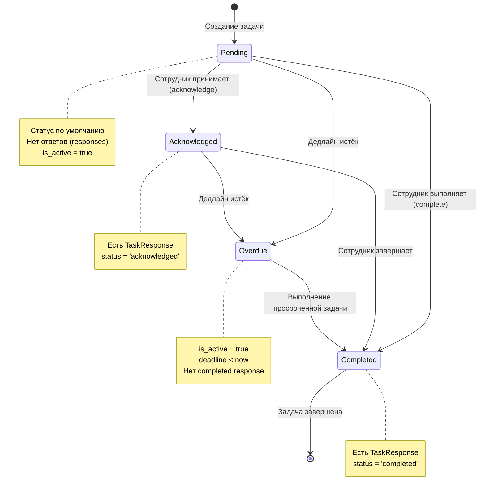
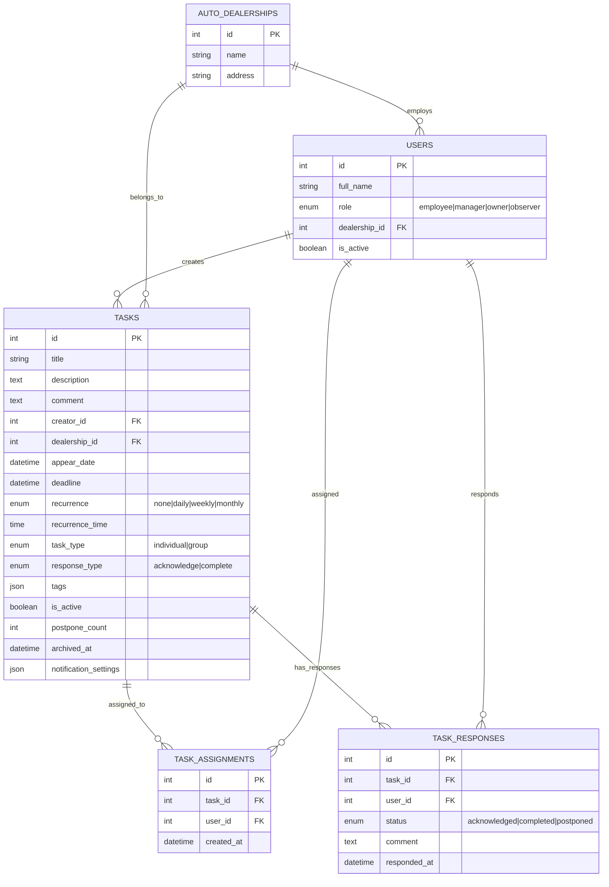
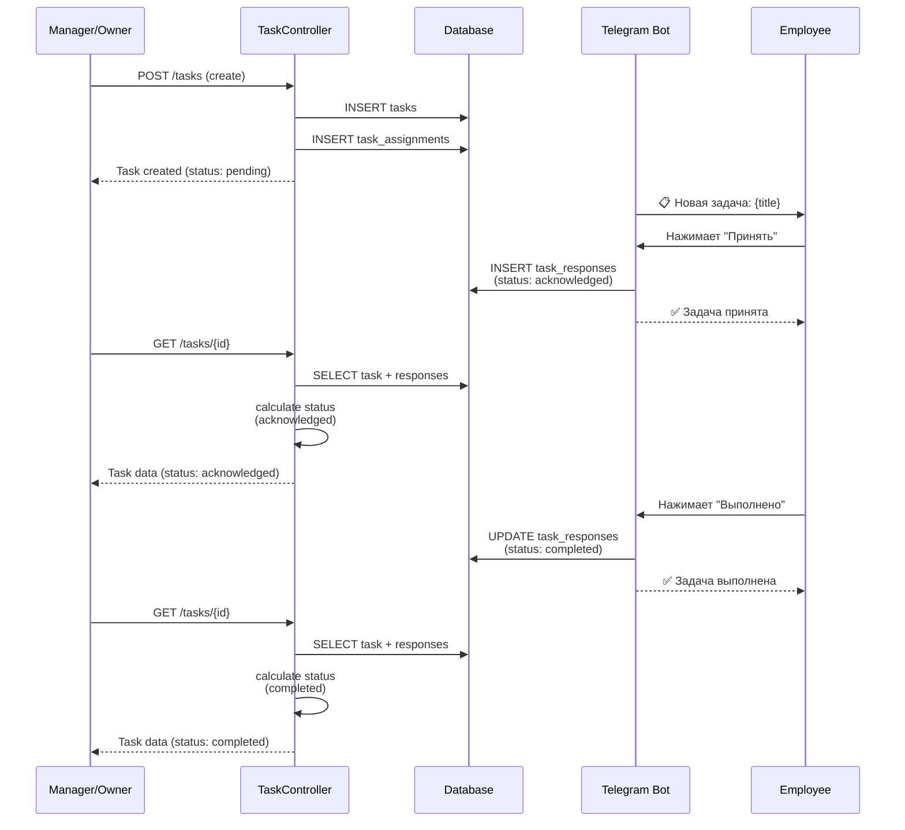
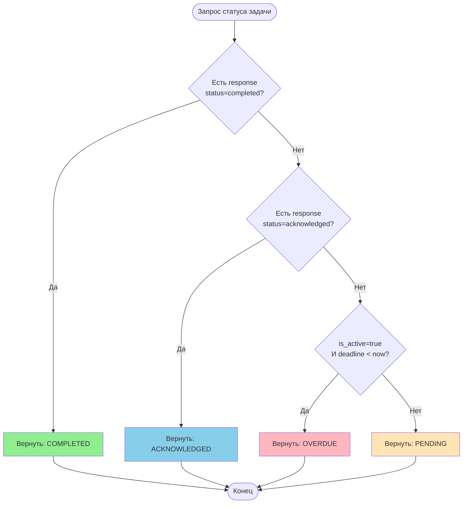
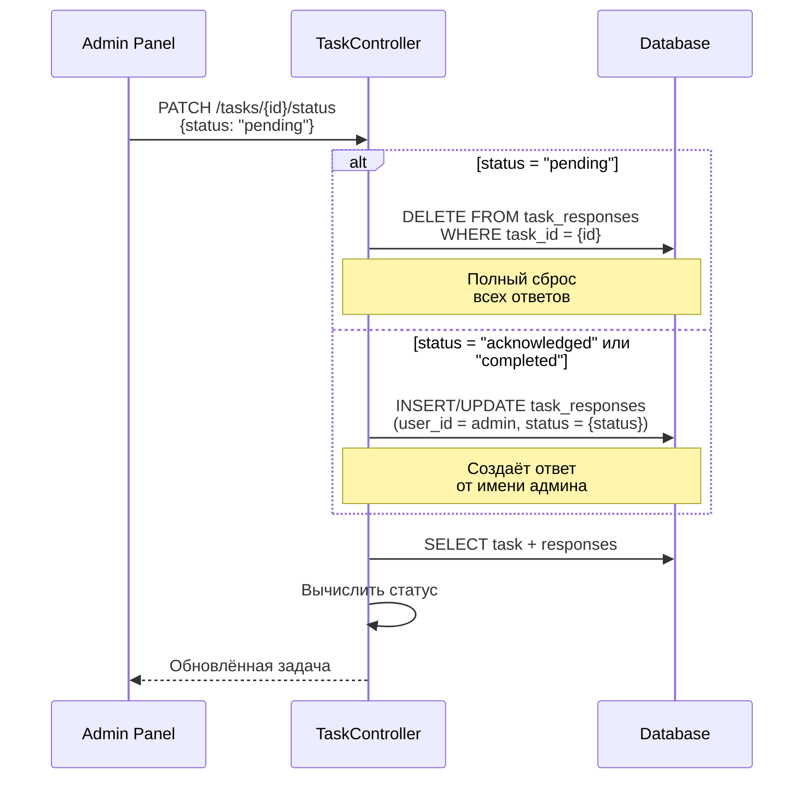
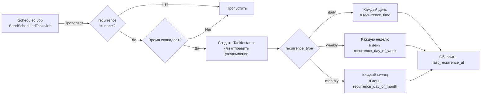

# TaskMate - Архитектура Системы Задач

## 1. Диаграмма Состояний Задачи



## 2. Структура Базы Данных



## 3. Жизненный Цикл Задачи



## 4. Логика Вычисления Статуса (getStatusAttribute)



## 5. Обновление Статуса Через Admin Panel



## 6. Повторяющиеся Задачи (Recurrence)



## 7. Проблемные Места и Логические Несостыковки

### 🔴 Проблема 1: Двойственность Статуса
**Описание**: Статус задачи не хранится в БД, а вычисляется на основе `task_responses`. Это создаёт несколько проблем:

1. **Групповые задачи**: Если task_type = 'group', один сотрудник может отметить как 'completed', а остальные - нет. Какой статус у задачи?
   ```
   Задача (group) → 3 сотрудника
   Сотрудник 1: completed
   Сотрудник 2: acknowledged
   Сотрудник 3: (нет ответа)
   
   Текущая логика: status = 'completed' (первый completed побеждает)
   Проблема: Админ видит "Выполнено", хотя 2/3 не выполнили
   ```

2. **Admin vs Employee конфликт**: Админ может установить статус через API (создав response от своего имени), но это НЕ реальный ответ сотрудника.

### 🔴 Проблема 2: Отложенные Задачи (Postponed)
**Текущее состояние**: 
- В БД есть `postpone_count`
- В Telegram боте есть PostponeTaskConversation
- TaskResponse может иметь status='postponed'
- Но мы УДАЛИЛИ 'postponed' из Admin Panel

**Несостыковка**:
- Сотрудник откладывает задачу через бота → `postpone_count` увеличивается
- Админ смотрит в панель → статус показывает 'pending' (т.к. мы удалили postponed логику)
- `postponed()` метод в TaskController ВСЕГДА возвращает задачи с `postpone_count > 0`, но никто его не использует

### 🔴 Проблема 3: Recurrence и Responses
**Сценарий**:
1. Создаётся повторяющаяся задача (daily)
2. Сотрудник выполняет её сегодня → создаётся TaskResponse(status='completed')
3. Завтра задача должна появиться снова
4. Но TaskResponse с вчерашнего дня ВСЁ ЕЩЁ существует
5. Статус показывает 'completed', хотя это новый день

**Отсутствующая логика**: Нет очистки responses для recurring задач.

### 🔴 Проблема 4: response_type Игнорируется
**Поля**:
- `task.response_type` = 'acknowledge' | 'complete'
- `task_response.status` = 'acknowledged' | 'completed' | 'postponed'

**Проблема**: 
- Если task.response_type = 'acknowledge', сотрудник ВСЕГДА может нажать "Выполнено" → status='completed'
- Поле response_type НЕ влияет на доступные действия сотрудника
- Цель поля неясна

### 🟡 Проблема 5: is_active Не Используется Консистентно
**Использование**:
- `index()`: Фильтрует `whereNull('archived_at')` (НЕ проверяет is_active)
- `getStatusAttribute`: Проверяет `is_active` для overdue
- Telegram бот: Не проверяет is_active

**Вопрос**: Что означает `is_active=false`? Это то же самое что `archived_at`? Почему два флага?

## 8. Рекомендации по Улучшению

### Вариант 1: Хранить Статус в БД
```sql
ALTER TABLE tasks ADD COLUMN status VARCHAR(50) DEFAULT 'pending';
CREATE INDEX idx_tasks_status ON tasks(status);
```

**Плюсы**:
- Простые запросы (WHERE status = 'completed')
- Нет вычислений при каждом SELECT
- Явный, предсказуемый статус

**Минусы**:
- Нужна синхронизация при создании/обновлении responses
- Дублирование данных

### Вариант 2: Создавать Новые Task Instances для Recurring
```
recurring_tasks (template)
  └─> task_instances (actual occurrences)
       └─> task_responses
```

**Плюсы**:
- Каждый день - новая задача с чистыми responses
- История выполнения сохраняется
- Нет конфликтов статусов

**Минусы**:
- Больше записей в БД
- Сложнее миграция

### Вариант 3: Удалить Групповые Задачи или Изменить Логику
**Если task_type='group'**:
- Вариант A: Статус = 'completed' только если ВСЕ ответили 'completed'
- Вариант B: Хранить отдельный статус для каждого assignee
- Вариант C: Убрать групповые задачи полностью

### Вариант 4: Унифицировать Postponed
**Либо**:
- Вернуть 'postponed' в Admin Panel
- Показывать postpone_count в UI
- Использовать `postponed()` endpoint

**Либо**:
- Удалить весь функционал postpone
- Удалить PostponeTaskConversation из бота
- Убрать `postpone_count` из БД

